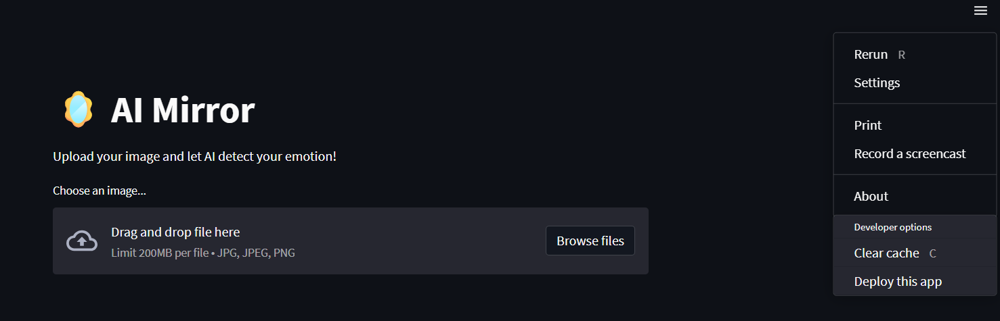
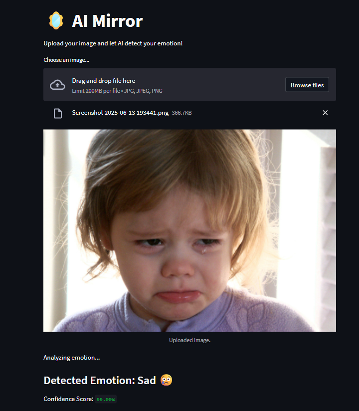

# VibeTalk – The AI Mirror App

VibeTalk is a Streamlit-based AI app that reads your uploaded selfie and predicts your current emotion using facial expression recognition. Based on the emotion, it gives a motivational response or a positive message.

## 💡 Features
- Detects emotions from images (happy, sad, angry, neutral, etc.)
- Shows confidence scores for each emotion
- Simple and clean UI with Streamlit
- Ready to be extended into a voice-based motivational mirror

## 📷 Screenshots
### Input


### Output


## ⚙️ How to Run

```bash
# Clone the repository
git clone https://github.com/yourusername/aimirror.git
cd aimirror

# Create virtual environment
python -m venv env
env\Scripts\activate

# Install dependencies
pip install -r requirements.txt

# Run the app
streamlit run ai_mirror_app.py
